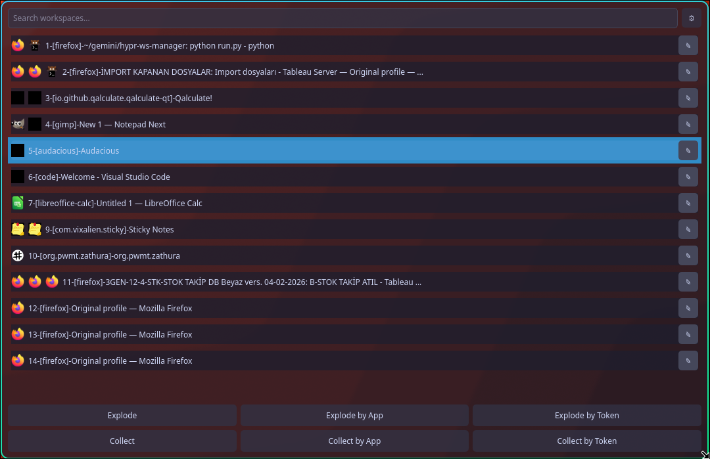
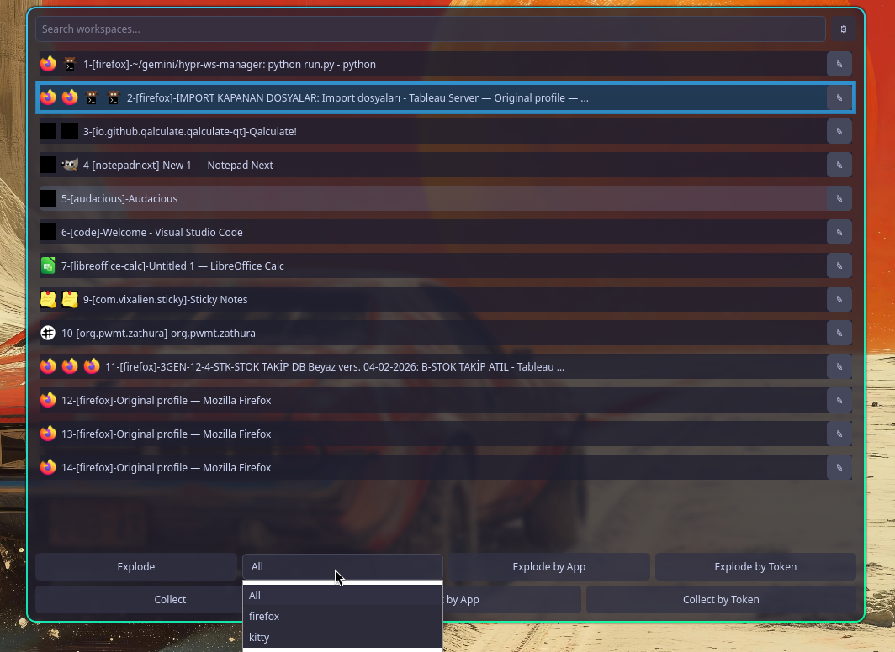

# Hyprland Workspace Manager


A lightweight Python GUI for naming, navigating Hyprland workspaces that allows window distribution, collection and pruning for intense workspace users.


## Features
- **Compliance with hyprctl:** No conflicts with Hyprland since it uses native hyprctl API.
- **Custom Naming:** Assign and manage custom names for your workspaces.
- **Explode Suite (Redistribute):**
    - **All:** Distribute every window to its own new workspace.
    - **Selective:** Distribute only windows of a chosen application type.
    - **By App:** Group multiple windows of the same type into a new workspace.
    - **By Token:** Group windows matching a title keyword into a new workspace.
- **Collect Suite (Gather):**
    - **All:** Pull all windows from every workspace into the selected one.
    - **By App:** Gather all windows of a specific type from across the system.
    - **By Token:** Gather windows matching a title keyword from any workspace.
- **Deep Search:** Instantly filter workspaces by ID, name, application class, or **individual window titles**.
- **Visual Polish:**
    - **Multi-Icon Support:** View up to 5 icons per workspace representing open apps.
    - **Active Workspace Highlight:** Visually identify your current location in the list.
    - **Auto-Theming:** Dark and Light mode support with adjustable transparency.
- **Smart Launching:** Opens centered in floating mode, stays on top, and focuses search automatically.
- **Keyboard Optimized:** Full navigation via Arrow Keys/Tab and Enter; Escape to close.
- **Auto-Reset:** Automatically clears names and configuration for empty workspaces.

## Screenshots
### Main Interface


### Selective Explode & Dynamic Inputs


## Installation & Setup

### Quick Start
Run the installer script, which will set up your desktop launcher, icon, and environment:
```bash
chmod +x install.sh
./install.sh
```

## Usage

After running the installer, **Hyprland Workspace Manager** will appear in your application launcher. You can also run it via terminal using `./launch.sh`.

### Basic Navigation & Controls
- **Adding a key combination binding in hyprland.conf is highly recommended.**
- **Keyboard (Primary)**:
  - **Tab / Arrow Keys**: Navigate through the workspace list.
  - **Enter**: Switch to the selected workspace.
  - **Search**: Start typing immediately upon launch to filter workspaces by name, ID, or window titles.
  - **Escape**: Close the manager instantly.
- **Collect Suite (Gather):**
    - **By App:** Gather all windows of a specific type (or **All** windows) from across the system into the selected workspace.
    - **By Token:** Gather windows matching a title keyword from any workspace.

...

### The "Explode" Suite (Redistribute)
The Explode tools help you clean up a cluttered workspace by moving its windows to new, dedicated workspaces. Select a source workspace from the list, then use:

- **Interaction (Click-to-Reveal)**: Action buttons follow a consistent pattern: Click once to reveal the filter dropdown or input box, and click again to execute.
- **Explode**: 
  - With **"All"** selected: Moves **every window** from the source workspace into its own separate, new workspace.
  - With a **specific app** selected: Moves **each window of that type** into its own unique, new workspace.
- **Explode by App**: 
  - With **"All"** selected: Groups windows by their type (e.g., all Firefox windows move together to one new workspace, all terminals move to another).
  - With a **specific app** selected: Moves **all windows of that type** together into a single new workspace.
- **Explode by Token**: Enter a keyword in the **Token...** box. Moves all windows containing that keyword in their title to a new workspace.

---

### The "Collect" Suite (Gather)
The Collect tools gather windows from across your entire system into your **selected workspace**.

- **Consolidated Controls**: The "Collect All" functionality is now integrated directly into **Collect by App** via a default **"All"** option.
- **Collect by App**: 
  - With **"All"** selected (default): Pulls **all windows** from every other workspace into the one you have selected.
  - With a **specific app** selected: Pulls only windows of that type into your selected workspace.
- **Collect by Token**: Enter a keyword in the **Token...** box. Pulls all windows containing that keyword in their title from across all workspaces into the selected one.

---

### Settings & Theming
Click the **⚙** icon in the top right to access settings:
- **Theme**: Switch between Light and Dark modes.
- **Transparency**: Adjust the window opacity (from Opaque to Glass-like).
- **hyprctl Path**: If you are using a non-standard Hyprland installation, you can configure the path to your `hyprctl` binary here.

---

## Configuration
Settings are stored in `~/.config/hypr-ws-manager/config.json`. You can adjust the `hyprctl` path, theme, and transparency directly through the in-app settings menu.

## Uninstallation
To remove the desktop launcher and icon from your system:
```bash
chmod +x uninstall.sh
./uninstall.sh
```

## License
This project is licensed under the GNU General Public License v3.0 (GPL-3.0). See the [LICENSE](LICENSE) file for details.
